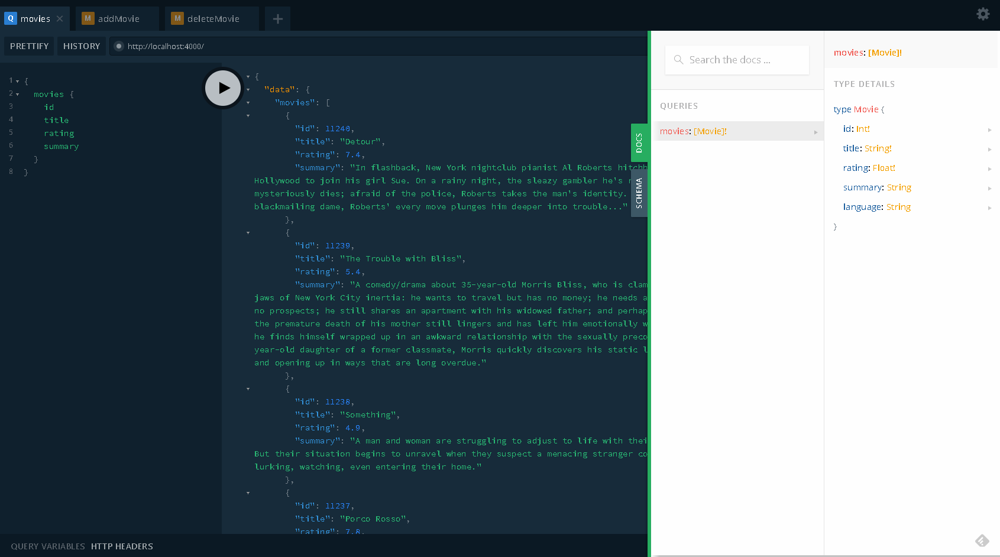

# movieql

Movie API with GraphQL

Getting Started
---

> install graphql-yoga

```$ yarn add graphql-yoga```

> Install dependencies

```$ yarn global add nodemon```

```$ yarn add babel-node -dev```

```$ yarn global add babel-cli babel-preset-env babel-preset-stage-3 --dev```

> Start server

```$ yarn start ```


Once your ```graphal-yoga``` server is running, open [GraphQL Playground](https://github.com/graphcool/graphql-playground) via ```localhost:4000```

:hammer: Crafted by using GraphQL
